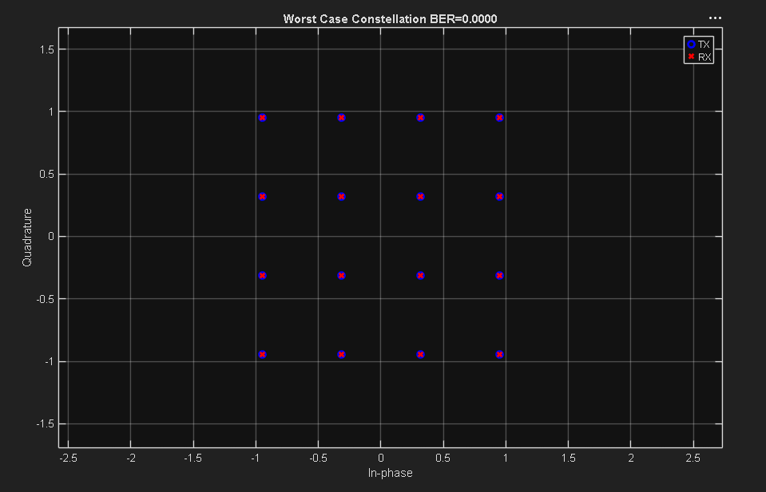

# OTFS-ZCD MATLAB 模擬

本專案使用 MATLAB 實作：

```text
OTFS
+
ZCD
```

並成功完成：

```text
發射 → 傳輸 → 接收 → 還原
```

完整 end-to-end 驗證。

---

# 這個專案在做什麼？


本專案基本流程如下：

```text
bit
→ OTFS
→ ZCD 波形
→ 傳輸
→ ZCD 解碼
→ OTFS 解調
→ recover 原始 bit
```

最後成功做到：

```text
BER = 0
```

也就是：

> 傳出去什麼，收回來就是什麼。

---

# OTFS 是什麼？

可以把 OTFS 想像成：

## 把資料排成一張表格

例如：

```text
┌────┬────┬────┬────┐
│  3 │ 12 │  7 │ 15 │
├────┼────┼────┼────┤
│  9 │  1 │  4 │  8 │
├────┼────┼────┼────┤
│  2 │ 11 │ 14 │  5 │
└────┴────┴────┴────┘
```

這就是：

```text
Delay-Doppler Domain
```

簡稱：

```text
DD domain
```

每個格子裡都放一個 symbol。

---

# OTFS 做了什麼？

OTFS 的工作就是：

把：

```text
DD domain
```

轉成：

```text
TF domain
```

也就是：

```text
Time-Frequency domain
```

因為：

```text
無線電實際上是靠時間與頻率傳送的
```

所以：

```text
資料表格
↓
轉換
↓
變成可以發射的訊號
```

---

# 那 ZCD 又是什麼？

ZCD 可以理解成：

```text
過零點檢測
```

意思是：

我們不直接讀波形振幅。

而是看：

```text
波形什麼時候穿過 0
```

例如：

```text
+0.5
+0.2
+0.1
 0
-0.2
-0.6
```

中間：

```text
從正變負
```

那個瞬間就是：

```text
zero crossing
```

---


```text
zero crossing
```

通常比：

```text
精準量振幅
```

更容易。

也更抗：

- amplitude distortion
- gain variation
- clipping

---

# 專案完整流程

整體流程：

```text
1. 產生 QAM symbols
    ↓
2. 放入 OTFS DD grid
    ↓
3. OTFS modulation（ISFFT）
    ↓
4. 每個 TF column 做 ZCD 發射
    ↓
5. 通道傳輸
    ↓
6. ZCD 接收端用 Least-Squares 還原
    ↓
7. inverse OTFS
    ↓
8. QAM 解調
    ↓
9. 比對 BER
```

下面一步一步拆開。

---

# Step 1 — 產生原始資料

程式：

```matlab
X_int = randi([0 15], M, N);
```

意思：

```text
隨機產生 M×N 個數字
```

例如：

```text
0 ~ 15
```

因為：

```text
16QAM
```

需要：

```text
16 個 symbol
```

---

# Step 2 — QAM 調變

程式：

```matlab
X_DD = qammod(X_int,16,'UnitAveragePower',true);
```

作用：

把：

```text
整數
```

變成：

```text
複數星座點
```

例如：

```text
3 → -1+1j
12 → 1-3j
```

這些複數值就是：

```text
真正準備傳輸的 symbol
```

---

# Step 3 — OTFS 調變

## 做 ISFFT

程式：

```matlab
X_TF = sqrt(M/N)*fft(ifft(X_DD,[],1),[],2);
```

先看：

```text
X_DD
```

是：

```text
Delay-Doppler grid
```

經過：

```text
ISFFT
```

變成：

```text
X_TF
```

也就是：

```text
Time-Frequency symbols
```

可以理解成：

```text
把資料從「表格座標」
轉換成
「可以拿去發射的頻率內容」
```

---

# Step 4 — ZCD 發射端

這一步最關鍵。

對每個：

```matlab
X_TF(:,n)
```

做：

```matlab
zcd_tx_symbol()
```

---

# 它在做什麼？

把：

```text
複數係數 ak
```

變成：

```text
實數波形 s(t)
```

程式核心：

```matlab
s_tx = s_tx + 2*real(ak(k)*exp(1j*2*pi*k*f0*t));
```

意思：

```text
把很多不同頻率的 sin 波疊加起來
```

每個：

```text
頻率
```

都乘上一個：

```text
ak
```

係數。

---

## 類比理解

可以想像：

```text
ak(1) 控制第1條聲音
ak(2) 控制第2條聲音
ak(3) 控制第3條聲音
...
```

最後全部混在一起。

形成：

```text
一條可發射的 waveform
```

---

# Step 5 — 通道

目前先用：

```text
ideal channel
```

也就是：

```matlab
rx = tx;
```

先確認：

```text
系統本身可不可行
```

還沒加入：

- noise
- fading
- multipath

---

# Step 6 — ZCD 接收端（最重要）

這是整個專案最後成功的關鍵。

---

# 一開始失敗在哪？

最早版本用：

```matlab
poly(rk)
```

從：

```text
roots
```

推回：

```text
coefficient
```

結果：

```text
有時成功
有時完全爆掉
```

BER 很高。

---

# 為什麼失敗？

因為：

```text
高階 polynomial coefficient reconstruction
數值上不穩定
```

簡單講：

```text
數學正確
但電腦算起來容易炸掉
```

---

# Least-Squares 解碼

這一步是整個專案最後成功的關鍵。

如果前面：

```text
OTFS modulation
→ waveform generation
```

是在：

```text
把資料變成波形送出去
```

那這一步就是：

```text
從收到的波形
反推出原本資料
```

---

# 先看發射端做了什麼？

發射端程式：

```matlab
s_tx = s_tx + 2*real(ak(k)*exp(1j*2*pi*k*f0*t));
```

如果把它展開，可以理解成：

```text
波形 =
第1個頻率 × ak(1)
+
第2個頻率 × ak(2)
+
第3個頻率 × ak(3)
+ ...
```

也就是：

```text
很多不同頻率的 sin 波疊加
```

而：

```text
ak(k)
```

決定每個頻率：

- 有多強
- 相位多少

---

# RX接收細節

接收端拿到：

```matlab
rx_signal
```

例如：

```text
0.42
0.85
0.11
-0.62
...
```

這是一整條波形。

但我們真正想知道的是：

```text
ak(1)
ak(2)
ak(3)
...
ak(M)
```

因為：

```text
這些 ak
才是真正承載資料的內容
```

---

# 所以接收端怎麼做？

我們先建立一個：

```text
Fourier basis matrix
```

程式：

```matlab
A = zeros(L,M);

for k = 1:M

    A(:,k) = exp(1j*2*pi*k*f0*t(:));

end
```

---

# A 是什麼？

可以把它理解成：

```text
所有可能的基礎波形資料庫
```

例如：

```text
A(:,1) = 第1個頻率波形
A(:,2) = 第2個頻率波形
A(:,3) = 第3個頻率波形
...
```

每一欄都是：

```text
一種標準頻率波形模板
```

---

# 舉例

假設：

```text
M = 3
```

那：

```text
A =
[
頻率1模板
頻率2模板
頻率3模板
]
```

---

# 接著做什麼？

接收波形：

```text
y
```

其實就是：

```text
這些模板的線性組合
```

也就是：

```text
y = A * ak
```

其中：

```text
y   = 接收到的 waveform
A   = 所有頻率模板
ak  = 每個模板的權重（我們想求的答案）
```

---

# 簡單來說：

如果：

```text
A(:,1) = 頻率1
A(:,2) = 頻率2
```

那：

```text
ak(1)=0.8
ak(2)=0.3
```

就表示：

```text
接收波形
=
0.8 × 頻率1
+
0.3 × 頻率2
```

---

# 現在我們已知什麼？

我們知道：

## 已知：

```text
A
```

因為：

```text
頻率是我們自己定義的
```

---

也知道：

```text
y
```

因為：

```text
這就是收到的波形
```

---

# 唯一不知道的是：

```text
ak
```

也就是：

```text
每個頻率用了多少權重
```

---

# 所以變成解方程式

變成：

```text
已知：
A
y

求：
ak
```

數學上：

```text
A * ak = y
```

---

# MATLAB 怎麼解？

就是：

```matlab
ak_rec = A \ y;
```

---

# 反斜線 `\`

MATLAB 的：

```matlab
\
```

代表：

```text
求解線性方程組
```

不是除法。

可以理解成：

```text
幫我找到一組 ak
讓：

A*ak ≈ y
```

---

# 為什麼使用 Least-Squares？

因為：

實際上不一定：

```text
完全相等
```

例如：

- noise
- sampling error
- 數值誤差

都可能存在。

所以 MATLAB 找的是：

```text
誤差最小
```

那組答案。

也就是：

```text
找 ak

使得：

||A*ak - y||

最小
```

意思：

```text
讓「重建波形」與「接收波形」差距最小
```

---

# 最後得到：

```matlab
ak_rec
```

也就是：

```text
還原出的 OTFS TF-domain symbol
```

再送回：

```text
inverse OTFS
```

即可還原：

```text
X_DD
```

---

# 為何這個方法最後成功？

因為它：

```text
直接從 waveform 找係數
```

不需要：

```text
zero crossing
→ roots
→ polynomial
```

這種容易數值不穩定的方法。

因此：

```text
更穩定
更容易計算
更不容易失敗
```

---

# 實驗結果

使用 Least-Squares decoder 後：

```text
Trials         : 200
Mean BER       : 0.00000000
Success Rate   : 100%
```

代表：

```text
所有測試全部成功
```

也就是：

```text
傳送出去什麼
就完整收回什麼
```

---

# Step 7 — inverse OTFS

拿回：

```text
X_TF_rec
```

再轉回：

```text
X_DD_rec
```

程式：

```matlab
X_DD_rec =
sqrt(N/M) *
fft(
    ifft(X_TF_rec,[],2),
[],1);
```

---

# Step 8 — 解調

把：

```text
complex symbols
```

轉回：

```text
0~15
```

程式：

```matlab
data_rec = qamdemod(...)
```

---

# Step 9 — BER 驗證

最後比較：

```text
發送前
```

與：

```text
接收後
```

是否一樣。

程式：

```matlab
ber = mean(X_int(:) ~= data_rec(:));
```

如果：

```text
BER = 0
```

代表：

```text
100% recover success
```

---

# 最終實驗結果

Monte Carlo：

```text
Trials         : 200
Mean BER       : 0.00000000
Median BER     : 0.00000000
Min BER        : 0.00000000
Max BER        : 0.00000000
Success Rate   : 100%
```

NMSE：

```text
Mean NMSE      : -287.20 dB
```



代表：

```text
還原結果幾乎與原始訊號完全一致
```

已接近 MATLAB double precision 極限。

---

# 最終結論

本專案成功驗證：

```text
OTFS + ZCD 是可行的
```

而且：

```text
可完整 end-to-end recover
BER = 0
```

---

# 執行方式

執行：

```matlab
otfs_zcd_end_to_end_montecarlo
```

即可。

---

# 後續可以繼續研究

推薦方向：

## 1. AWGN channel

加入雜訊：

```text
BER vs SNR
```

---

# 2. PAPR

比較：

```text
CP-OTFS
vs
ZCD-OTFS
```

---

# 3. 真實無線通道

加入：

- multipath
- delay spread
- Doppler spread

---


本專案為 OTFS + ZCD waveform integration MATLAB research prototype。

用於驗證：

```text
OTFS over Zero Crossing Detection waveform transmission feasibility
```
