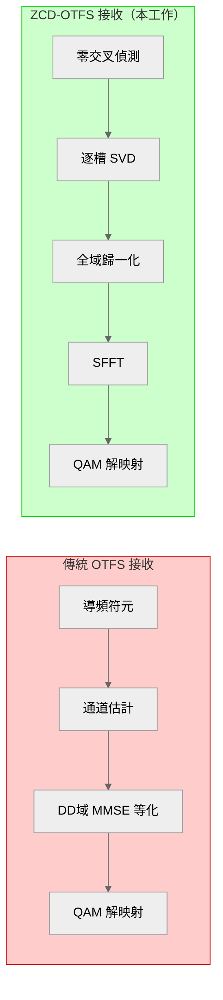
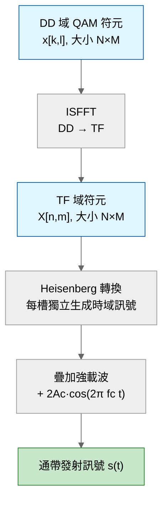
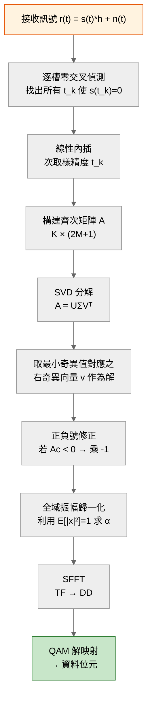
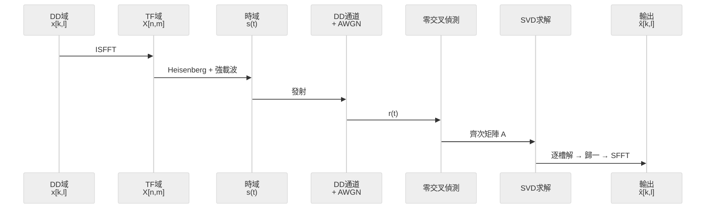
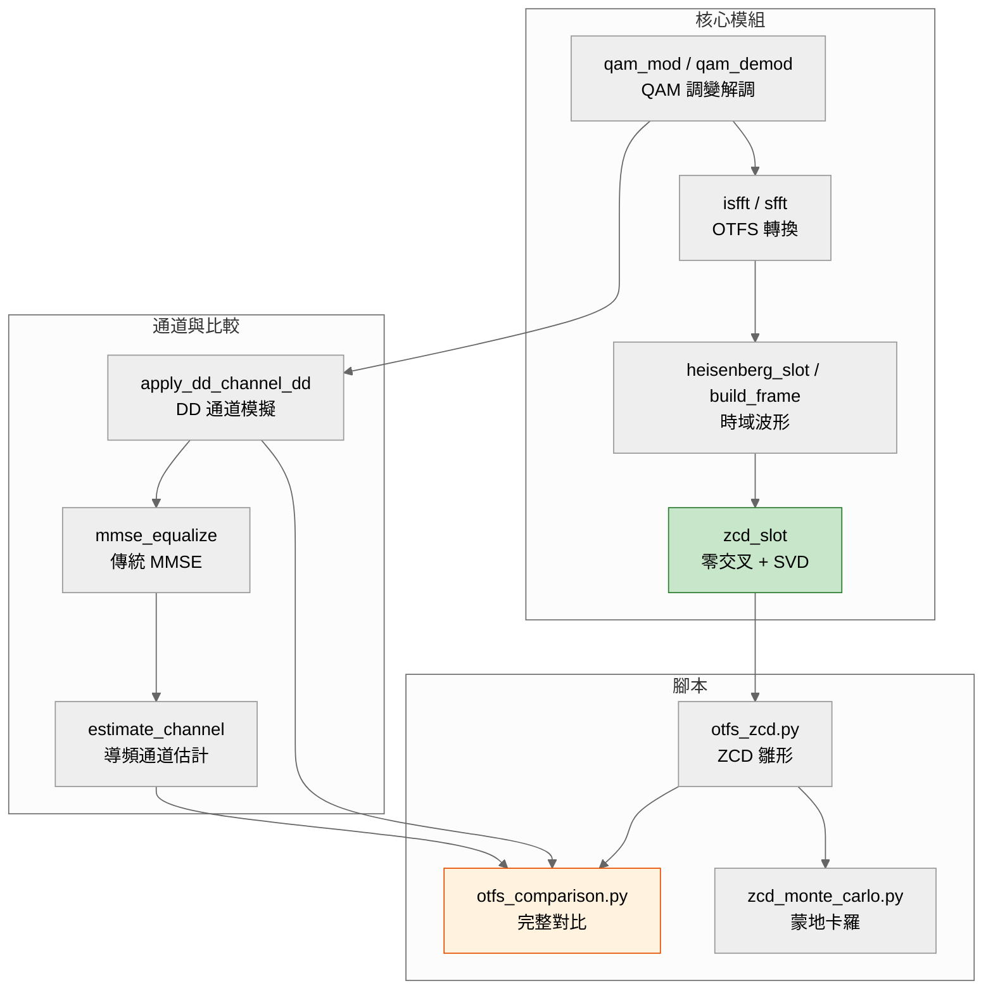
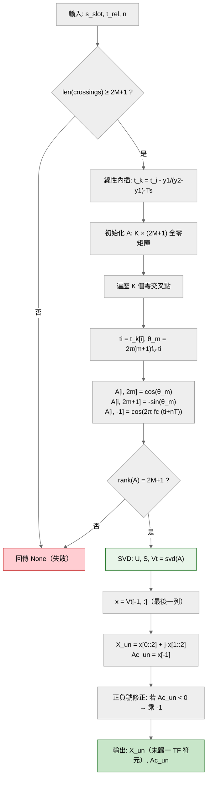
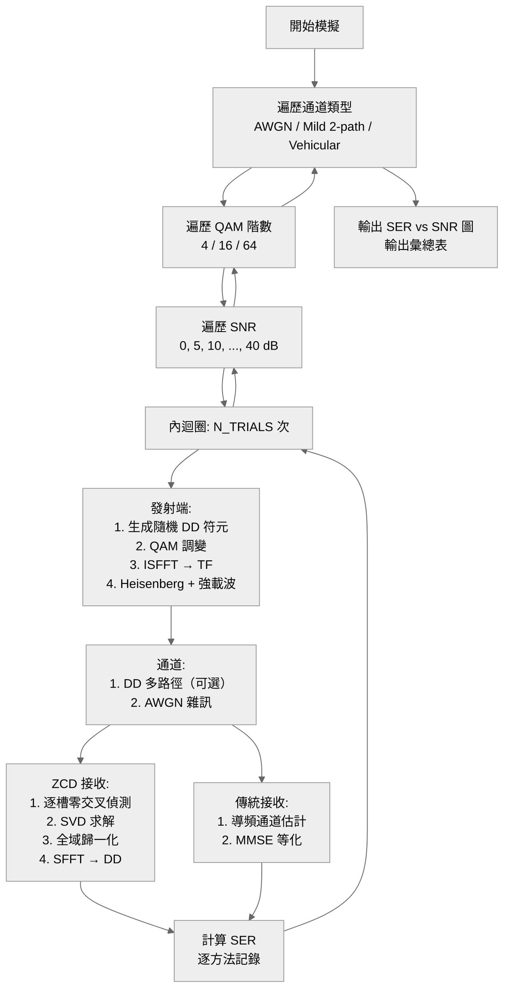

# OTFS 零交叉偵測解調系統（ZCD-OTFS）

> **基於零交叉偵測的解調 OTFS 系統 **


---

## 📋 目錄

- [1. 概述](#1-概述)
- [2. 系統架構](#2-系統架構)
- [3. 數學基礎與逐步推導](#3-數學基礎與逐步推導)
  - [3.1 星座圖映射（QAM Modulation）](#31-星座圖映射qam-modulation)
  - [3.2 ISFFT：DD 域 → TF 域](#32-isfftdd-域--tf-域)
  - [3.3 Heisenberg 轉換：TF 域 → 連續時間訊號](#33-heisenberg-轉換tf-域--連續時間訊號)
  - [3.4 強載波嵌入與 Ac 的決定](#34-強載波嵌入與-ac-的決定)
  - [3.5 零交叉偵測（ZCD）與線性內插](#35-零交叉偵測zcd與線性內插)
  - [3.6 齊次線性方程組的構建](#36-齊次線性方程組的構建)
  - [3.7 SVD 求解零空間](#37-svd-求解零空間)
  - [3.8 振幅歸一化與正負號消除](#38-振幅歸一化與正負號消除)
  - [3.9 SFFT：TF 域 → DD 域](#39-sffttf-域--dd-域)
  - [3.10 QAM 解映射與 SER 計算](#310-qam-解映射與-ser-計算)
  - [3.11 延遲-都卜勒通道模型](#311-延遲-都卜勒通道模型)
  - [3.12 雜訊模型（AWGN）](#312-雜訊模型awgn)
- [4. 程式碼架構](#4-程式碼架構)
- [5. 函式介面規格](#5-函式介面規格)
- [6. 模擬結果](#6-模擬結果)
- [7. 快速開始](#7-快速開始)
- [8. 數學速查表](#8-數學速查表)

---

## 1. 概述

### 與傳統 OTFS 的對比



---

## 2. 系統架構

### 2.1 發射端（TX）流程



### 2.2 接收端（RX）流程



### 2.3 完整收發鏈



---

## 3. 數學基礎與逐步推導

> 本節對每一個步驟進行推導，從最基礎的符元定義開始，直到最終的 SER 輸出。交代公式的來歷和變數定義。

---

### 3.1 星座圖映射（QAM Modulation）

#### 定義

給定 $M_{\text{QAM}} \in \{4, 16, 64\}$ 階 QAM，定義複數星座點集合：

$$\mathcal{C} = \{c_0, c_1, \dots, c_{M_{\text{QAM}}-1}\}$$

滿足**單位平均功率**約束：

$$\frac{1}{M_{\text{QAM}}} \sum_{q=0}^{M_{\text{QAM}}-1} |c_q|^2 = 1$$

#### QPSK 範例（ $M_{\text{QAM}} = 4$ ）

$$\mathcal{C}_{\text{QPSK}} = 
\left[
\frac{1+1j}{\sqrt{2}},\;
\frac{-1+1j}{\sqrt{2}},\;
\frac{-1-1j}{\sqrt{2}},\;
\frac{1-1j}{\sqrt{2}}
\right
]$$

每一點的能量均為 $ (1^2 + 1^2)/2 = 1 $，滿足歸一約束。

#### 16QAM 範例

$$\mathcal{C}_{\text{16QAM}} = \left\[
\frac{a + jb}{\sqrt{10}} \;:\; a,b \in \{-3,-1,1,3\}
\right\]$$

歸一因子 $\sqrt{10}$ 來自：

$$\mathbb{E}[|c|^2] = \frac{1}{16}\sum_{a}\sum_{b} \frac{a^2+b^2}{10} = \frac{1}{16} \cdot 16 \cdot \frac{10}{10} = 1$$

#### 調變操作

給定整數資料矩陣 $\mathbf{D} \in \{0,\dots,M_{\text{QAM}}-1\}^{N \times M}$：

$$x[k,l] = c_{D[k,l]}, \quad c_q \in \mathcal{C}$$

---

### 3.2 ISFFT：DD 域 → TF 域

#### 離散定義

逆辛有限傅立葉轉換（ISFFT）：

$$X[n,m] = \frac{1}{\sqrt{NM}} \sum_{k=0}^{N-1} \sum_{l=0}^{M-1} x[k,l] \,
\exp\!\left[j2\pi\left(\frac{nk}{N} - \frac{ml}{M}\right)\right]$$

#### 變數說明

| 符號 | 範圍 | 意義 |
|---|---|---|
| $k$ | $0,\dots,N-1$ | 都卜勒域索引 |
| $l$ | $0,\dots,M-1$ | 延遲域索引 |
| $n$ | $0,\dots,N-1$ | 時槽索引（輸出） |
| $m$ | $0,\dots,M-1$ | 子載波索引（輸出） |
| $\frac{1}{\sqrt{NM}}$ | 常數 | 歸一化因子，保證 Parseval 恆等式 |

#### 矩陣形式推導

令 $\mathbf{F}_N$ 為歸一化 DFT 矩陣：

$$\mathbf{F}_N = \frac{1}{\sqrt{N}}\begin{bmatrix}
1 & 1 & 1 & \cdots & 1 \\
1 & \omega_N & \omega_N^2 & \cdots & \omega_N^{N-1} \\
\vdots & \vdots & \vdots & \ddots & \vdots \\
1 & \omega_N^{N-1} & \omega_N^{2(N-1)} & \cdots & \omega_N^{(N-1)^2}
\end{bmatrix}, \quad \omega_N = e^{j2\pi/N}$$

則 ISFFT 可寫為：

$$\mathbf{X}_{\text{TF}} = \mathbf{F}_N \cdot \mathbf{x}_{\text{DD}} \cdot \mathbf{F}_M^H$$

**解釋**：
- 左乘 $\mathbf{F}_N$：沿行方向（都卜勒軸）做 FFT
- 右乘 $\mathbf{F}_M^H$：沿列方向（延遲軸）做 IFFT

#### 歸一性驗證

ISFFT 是么正（unitary）轉換，滿足：

$$\sum_{n,m} |X[n,m]|^2 = \sum_{k,l} |x[k,l]|^2$$

這意味著 TF 域的總能量等於 DD 域的總能量。

---

### 3.3 Heisenberg 轉換：TF 域 → 連續時間訊號

#### 矩形脈衝 OTFS

對於矩形脈衝波形，第 $n$ 個時槽 $t \in [nT, (n+1)T]$ 的通帶訊號為：

$$s_n(t) = 2\,\Re\!\left\[\sum_{m=0}^{M-1} X[n,m] \cdot \exp\!\big[j2\pi (m+1) f_0 t\big]\right\]$$

#### 為什麼是 $(m+1)f_0$ 而非 $mf_0$？

傳統 OFDM 使用 $mf_0$（包含 DC 子載波 $m=0$）。但在 ZCD-OTFS 中， $m=0$ 會導致：

$$\sin(2\pi \cdot 0 \cdot f_0 \cdot t) = 0$$

使得後續 $\mathbf{A}$ 矩陣的對應列為零，**秩虧損**。

使用 $(m+1)f_0$ 後，物理頻率範圍變為：

$$f_{\text{sub}} \in \{f_0, 2f_0, 3f_0, \dots, M f_0\}$$

有效迴避 DC 問題。

#### 展開為實部與虛部

令 $X[n,m] = a_{n,m} + j b_{n,m}$，則：

$$s_n(t) = 2\sum_{m=0}^{M-1} \Big[ a_{n,m} \cos\big(2\pi(m+1)f_0 t\big) - b_{n,m} \sin\big(2\pi(m+1)f_0 t\big) \Big]$$

---

### 3.4 強載波嵌入與 Ac 的決定

#### 動機

若只有資料子載波，零交叉點數量不穩定，可能低於未知數 $2M+1$。嵌入一個**位於資料頻帶外側的強載波**來保證充足的零交叉。

#### 載波頻率選擇

$$f_c = (M+1) \cdot f_0$$

選擇 $f_c$ 正好在資料子載波的上方相鄰處。

#### 載波振幅設計

每個 QPSK 符元的振幅為 $|x[k,l]| = 1/\sqrt{2} \approx 0.707$。64 個符元的振幅總和為 $64/\sqrt{2} \approx 45.3$。

設計載波振幅與資料總強度掛鉤：

$$A_c = \frac{1}{2}\sum_{k=0}^{N-1}\sum_{l=0}^{M-1} |x[k,l]| + 1$$

**設計原理**：載波振幅約為所有符元振幅總和的一半再加上一個偏移量 1。在 QPSK 單位功率下， $|x[k,l]| = 1/\sqrt{2}$ 為定值，因此：

$$A_c = \frac{NM}{2\sqrt{2}} + 1$$

對於 $N=4, M=8: A_c = 32/(2\sqrt{2}) + 1 \approx 12.3$ 。

#### 完整發射訊號

$$s(t) = s_{\text{data}}(t) + 2A_c \cos(2\pi f_c t)$$

其中 $s_{\text{data}}(t)$ 為所有時槽的 Heisenberg 輸出串接。

---

### 3.5 零交叉偵測（ZCD）與線性內插

#### 定義

零交叉瞬間為：

$$\{t_k : s(t_k) = 0 \text{ 且 } s(t) \text{ 在 } t_k \text{ 處改變符號}\}$$

#### 離散偵測

取樣後的離散訊號為 $s[i] = s(iT_s)$，$T_s = 1/f_s$。

尋找滿足 $s[i] \cdot s[i+1] < 0$ 的索引 $i$。在此區間內存在唯一零交叉。

#### 線性內插求精確位置

在 $[t_i, t_{i+1}]$ 內以直線近似 $s(t)$：

$$\frac{t_k - t_i}{-s[i]} = \frac{t_{i+1} - t_i}{s[i+1] - s[i]}$$

整理得：

$$t_k = t_i + \frac{-s[i]}{s[i+1] - s[i]} \cdot T_s$$

對於 $f_s = 2000 f_c$ 的設定，時間精度約為：

$$T_s \approx \frac{1}{2000 \times 180\text{kHz}} \approx 2.78\text{ ns}$$

線性內插進一步提高精度約兩個數量級。

#### 零交叉數下界

強載波 $2A_c\cos(2\pi f_c t)$ 的頻率 $f_c$ 高於所有資料子載波，在每個時槽 $T = 1/f_0$ 內產生約 $2f_c T = 2(M+1)$ 次零交叉。因此：

$$K \geq 2(M+1) = 2M + 2 \geq 2M + 1 \quad \checkmark$$

系統恆為**適定**（well-determined）。

---

### 3.6 齊次線性方程組的構建

#### 單一零交叉點方程式

在第 $n$ 個時槽，零交叉瞬間 $t_k$（絕對時間 $t_k^{\text{abs}} = t_k + nT$）滿足 $s(t_k^{\text{abs}}) = 0$：

$$\sum_{m=0}^{M-1} \Big[ a_{n,m} \cos\big(2\pi(m+1)f_0 t_k\big) - b_{n,m} \sin\big(2\pi(m+1)f_0 t_k\big) \Big] + A_c \cos(2\pi f_c t_k^{\text{abs}}) = 0$$

#### 將所有零交叉點堆疊

對 $K$ 個零交叉點，定義矩陣 $\mathbf{A} \in \mathbb{R}^{K \times (2M+1)}$ 和向量 $\mathbf{x} \in \mathbb{R}^{2M+1}$：

$$\mathbf{x} = \begin{bmatrix}
a_0 & b_0 & a_1 & b_1 & \cdots & a_{M-1} & b_{M-1} & A_c
\end{bmatrix}^T$$

矩陣 $\mathbf{A}$ 的第 $i$ 列構建如下（ $\theta_m = 2\pi(m+1)f_0 t_i$ ）：

$$\mathbf{A}[i, :] = \begin{bmatrix}
\cos\theta_0 & -\sin\theta_0 & \cos\theta_1 & -\sin\theta_1 & \cdots & \cos\theta_{M-1} & -\sin\theta_{M-1} & \cos(2\pi f_c t_i^{\text{abs}})
\end{bmatrix}$$

#### 齊次系統

$$\mathbf{A} \mathbf{x} = \mathbf{0}$$

共 $K$ 條方程式， $2M+1$ 個未知數。

---

### 3.7 SVD 求解零空間

#### 為什麼不能用普通最小平方法？

對齊次方程 $\mathbf{A}\mathbf{x} = \mathbf{0}$ ，直接使用 `A\b`（即 $\mathbf{x} = \mathbf{A}^+ \mathbf{0}$ ）只會得到 $\mathbf{x} = \mathbf{0}$，毫無意義。

正確做法：求 $\mathbf{A}$ 的**零空間（null space）**。

#### 奇異值分解（SVD）

$$\mathbf{A} = \mathbf{U} \boldsymbol{\Sigma} \mathbf{V}^T$$

其中：
- $\mathbf{U} \in \mathbb{R}^{K \times K}$ ：左奇異向量矩陣
- $\boldsymbol{\Sigma} \in \mathbb{R}^{K \times (2M+1)}$ ：對角奇異值矩陣， $\sigma_1 \geq \sigma_2 \geq \cdots \geq \sigma_{2M+1} \geq 0$
- $\mathbf{V} \in \mathbb{R}^{(2M+1) \times (2M+1)}$ ：右奇異向量矩陣

#### 最小化問題

求解：

$$
\min_{\|\mathbf{x}\|_2 = 1} \|\mathbf{A}\mathbf{x}\|_2
$$

利用 SVD 性質，對任意單位向量 $\mathbf{x}$：

$$\|\mathbf{A}\mathbf{x}\|_2^2 = \sum_{j=1}^{2M+1} \sigma_j^2 |\mathbf{v}_j^T \mathbf{x}|^2$$

在約束 $\|\mathbf{x}\|_2 = 1$ 下（即 $\sum_j |\mathbf{v}_j^T\mathbf{x}|^2 = 1$)

最小值發生在 $\mathbf{x}$ 與 $\mathbf{v}_{2M+1}$（最小奇異值對應的右奇異向量）共線時，此時：

$$\|\mathbf{A}\mathbf{v}_{2M+1}\|_2 = \sigma_{\min}$$

#### 最終解

$$\hat{\mathbf{x}} = \mathbf{V}[:, -1] \quad \text{（最後一列）}$$

從 $\hat{\mathbf{x}}$ 中提取：

$$\hat{a}_m = \hat{\mathbf{x}}[2m], \quad \hat{b}_m = \hat{\mathbf{x}}[2m+1], \quad \hat{A}_c = \hat{\mathbf{x}}[-1]$$

$$\hat{X}[m] = \hat{a}_m + j\hat{b}_m$$

---

### 3.8 振幅歸一化與正負號消除

#### 問題

SVD 給出的 $\hat{\mathbf{x}}$ 只確定了方向，實際解為 $\mathbf{x} = \alpha \hat{\mathbf{x}}$，其中 $\alpha$ 未知。

#### 正負號消除

零空間的方向可以是 $\hat{\mathbf{x}}$ 或 $-\hat{\mathbf{x}}$。利用 $A_c$ 恆為正的物理約束：

$$\text{若 }\hat{A}_c < 0\text{，則 } \hat{\mathbf{x}} \leftarrow -\hat{\mathbf{x}}$$

#### 全域歸一化求 $\alpha$

利用星座圖的**單位平均功率**性質：

$$\mathbb{E}[|x[k,l]|^2] = 1$$

ISFFT 為么正轉換，此性質也保留在 TF 域：

$$\frac{1}{NM} \sum_{n=0}^{N-1} \sum_{m=0}^{M-1} |X[n,m]|^2 = 1$$

因此：

$$\frac{1}{NM} \sum_{n,m} |\alpha \hat{X}[n,m]|^2 = 1$$

$$\alpha^2 \cdot \frac{1}{NM} \sum_{n,m} |\hat{X}[n,m]|^2 = 1$$

$$\boxed{\alpha = \sqrt{\frac{NM}{\sum_{n,m} |\hat{X}[n,m]|^2}}}$$

#### 逐槽歸一 vs 全域歸一

| 方法 | 公式 | SFFT 後結果 |
|---|---|---|
| 逐槽歸一 ❌ | $\alpha_n = \sqrt{M / \sum_m \|\hat{X}_n[m]\|^2}$ | 槽間振幅失配，高 QAM 有 SER 地板 |
| 全域歸一 ✅ | $\alpha = \sqrt{NM / \sum_{n,m} \|\hat{X}[n,m]\|^2}$ | 保持么正性質，**完美復原** |

---

### 3.9 SFFT：TF 域 → DD 域

#### 離散定義

辛有限傅立葉轉換（SFFT）為 ISFFT 的逆：

$$x[k,l] = \frac{1}{\sqrt{NM}} \sum_{n=0}^{N-1} \sum_{m=0}^{M-1} X[n,m] \,
\exp\!\left[-j2\pi\left(\frac{nk}{N} - \frac{ml}{M}\right)\right]$$

#### 矩陣形式

$$\hat{\mathbf{x}}_{\text{DD}} = \mathbf{F}_N^H \cdot \hat{\mathbf{X}}_{\text{TF}} \cdot \mathbf{F}_M$$

#### Python 實作

```python
def sfft(X_tf):
    N, M = X_tf.shape
    x_dd = np.fft.ifft(X_tf, axis=0) * np.sqrt(N)   # Doppler → IFFT
    x_dd = np.fft.fft(x_dd, axis=1) / np.sqrt(M)     # Delay → FFT
    return x_dd
```

---

### 3.10 QAM 解映射與 SER 計算

#### 最大似然檢測

對 DD 域的每個估計符元 $\hat{x}[k,l]$，找最近的星座點：

$$\hat{D}[k,l] = \underset{q \in \{0,\dots,M_{\text{QAM}}-1\}}{\arg\min} \; |\hat{x}[k,l] - c_q|$$

#### SER 定義

$$\text{SER} = \frac{1}{NM} \sum_{k=0}^{N-1} \sum_{l=0}^{M-1} \mathbf{1}\!\left[\hat{D}[k,l] \neq D[k,l]\right]$$

---

### 3.11 延遲-都卜勒通道模型

#### 物理模型

$P$ 條路徑，每條具有延遲 $\tau_p$、都卜勒偏移 $\nu_p$、複數增益 $h_p$：

$$h(\tau, \nu) = \sum_{p=0}^{P-1} h_p \, \delta(\tau - \tau_p) \, \delta(\nu - \nu_p)$$

#### 離散化

延遲解析度為 $\Delta\tau = T/M$，都卜勒解析度為 $\Delta\nu = 1/(NT)$。

$$\begin{aligned}
l_p &= \left\lfloor \frac{\tau_p}{\Delta\tau} \right\rceil \\
k_p &= \left\lfloor \frac{\nu_p}{\Delta\nu} \right\rceil
\end{aligned}$$

#### DD 域輸入輸出關係

$$y[k,l] = \sum_{p=0}^{P-1} h_p \cdot x\!\left[(k - k_p)_N, (l - l_p)_M\right] \cdot \exp\!\left[j2\pi \frac{(k - k_p)_N \cdot l_p}{NM}\right]$$

其中 $(\cdot)_N$ 表示模 $N$ 循環，$(\cdot)_M$ 表示模 $M$ 循環。

#### 相位項的來源

延遲 $l_p$ 在不同都卜勒 bin 之間引入線性相位偏移。對於第 $(k,l)$ 個接收格點，若訊號來自 $(k-k_p, l-l_p)$，則累積的相位為：

$$\phi_p = 2\pi \cdot \frac{(k - k_p)_N \cdot l_p}{NM}$$

---

### 3.12 雜訊模型（AWGN）

#### DD 域 SNR（傳統 OTFS）

$$\text{SNR}_{\text{DD}} = \frac{\mathbb{E}[|y_{\text{clean}}[k,l]|^2]}{\sigma_n^2}$$

雜訊為複高斯：

$$n[k,l] \sim \mathcal{CN}(0, \sigma_n^2)$$

$$y[k,l] = y_{\text{clean}}[k,l] + n[k,l]$$

#### 時域 SNR（ZCD-OTFS）

$$\text{SNR}_{\text{time}} = \frac{\mathbb{E}[s^2(t)]}{\sigma_w^2}$$

雜訊為實高斯：

$$w(t) \sim \mathcal{N}(0, \sigma_w^2)$$

$$r(t) = s_{\text{rx,clean}}(t) + w(t)$$

兩者透過單位換算等價。本系統使用實際訊號功率計算雜訊方差：

$$\sigma_w^2 = \frac{\mathbb{E}[s_{\text{rx,clean}}^2(t)]}{10^{\text{SNR(dB)}/10}}$$

---

## 4. 程式碼架構

### 4.1 模組相依關係



### 4.2 ZCD 核心函式內部流程



### 4.3 完整模擬試驗流程



---

## 5. 函式介面規格

### 5.1 QAM 模組

#### `qam_pts(order) → ndarray`
```
輸入：order      int       星座階數 (4 | 16 | 64)
輸出：pts        (order,)  complex  歸一化星座點
```

#### `qam_mod(data, order) → ndarray`
```
輸入：data       任意形狀    int      整數 ∈ {0, …, order-1}
      order      int                 星座階數
輸出：symbols    同輸入形狀  complex  對應星座點
```

#### `qam_demod(symbols, order) → ndarray`
```
輸入：symbols    任意形狀    complex  接收符元
      order      int                 星座階數
輸出：data       同輸入形狀  int      最近星座點索引（最大似然）
```

### 5.2 OTFS 轉換

#### `isfft(x_dd) → X_tf`
```
輸入：x_dd       (N, M)     complex  DD 域符元
輸出：X_tf       (N, M)     complex  TF 域符元
說明：歸一么正轉換，保持總能量不變
```

#### `sfft(X_tf) → x_dd`
```
輸入：X_tf       (N, M)     complex  TF 域符元
輸出：x_dd       (N, M)     complex  DD 域符元
```

### 5.3 時域波形

#### `heisenberg_slot(X_row, t_rel) → s_slot`
```
輸入：X_row      (M,)       complex  單槽 TF 符元
      t_rel      (L,)       float64  該槽相對時間向量
輸出：s_slot     (L,)       float64  該槽通帶訊號（實數）
```

#### `build_frame(X_tf, Ac) → s_frame`
```
輸入：X_tf       (N, M)     complex  全幀 TF 符元
      Ac         float               載波振幅
輸出：s_frame    (L_total,) float64  全幀通帶發射訊號
```

### 5.4 ZCD 核心

#### `zcd_slot(s_slot, t_rel, n) → (X_un, Ac_un) | None`
```
輸入：s_slot     (L,)       float64  單槽接收訊號
      t_rel      (L,)       float64  該槽相對時間向量
      n          int                 槽索引（用於載波相位）
輸出：X_un       (M,)       complex  未歸一 TF 符元（方向正確）
      Ac_un      float               未歸一載波振幅估計值
      或 None                        秩不足時回傳
```

### 5.5 通道模型

#### `apply_dd_channel_dd(x_dd, paths) → y_dd`
```
輸入：x_dd       (N, M)     complex  DD 發射符元
      paths      list of (τ, ν, h)   多路徑參數
輸出：y_dd       (N, M)     complex  DD 接收符元（無雜訊）
```

#### `dd_channel_matrix(paths, N, M) → H_eff`
```
輸入：paths      list of (τ, ν, h)   多路徑參數
      N, M       int                 DD 網格大小
輸出：H_eff      (NM, NM)   complex  等效 DD 域通道矩陣
```

---


## 7. 快速開始

### 7.1 環境需求

```bash
pip install numpy scipy matplotlib
```

### 7.2 執行單次 ZCD-OTFS 模擬

```bash
python otfs_zcd.py
```

預期輸出：

```
OTFS + ZCD  Prototype
  DD 網格:          4×8 = 32 個 QPSK 符元
  子載波:           f0 ~ 8·f0（已跳過 DC）
  fc = 180.0 kHz,   fs = 360.0 MHz
  每槽未知數:       2×8+1 = 17
  每槽零交叉 ≈      2×(8+1) = 18

Detected crossings = 18
Rank(A) = 17
SER = 0.00000000   ← 完美復原！
```

### 7.3 執行完整對比

```bash
python otfs_comparison.py
```

輸出：`otfs_comparison.png`（三種通道 × 三種 QAM 的 SER 曲線圖）。

### 7.4 蒙地卡羅穩定性驗證（500 次）

```bash
python zcd_monte_carlo.py
```

---

## 8. 數學速查表

### 8.1 秩條件

| 條件 | 說明 |
|---|---|
| 未知數個數 | $2M+1$（$M$ 個複數 TF 符元 + 1 個 $A_c$） |
| 零交叉數 $K$ | $\approx 2(M+1)$（由強載波保證） |
| 判定 | $2(M+1) \geq 2M+1$ ✓ → **恆適定** |

### 8.2 關鍵公式一覽

| 步驟 | 公式 |
|---|---|
| 時域訊號（單槽） | $s_n(t) = 2\Re\{\sum_m X[n,m] e^{j2\pi(m+1)f_0 t}\}$ |
| 載波振幅 | $A_c = \frac{1}{2}\sum\|x[k,l]\| + 1$ |
| 零交叉內插 | $t_k = t_i + \frac{-s[i]}{s[i+1]-s[i]} T_s$ |
| 齊次系統 | $\mathbf{A}\mathbf{x} = \mathbf{0}$， $\mathbf{A} \in \mathbb{R}^{K \times (2M+1)}$ |
| SVD 解 | $\hat{\mathbf{x}} = \arg\min_{\|\mathbf{x}\|=1} \|\mathbf{Ax}\| = \mathbf{v}_{2M+1}$ |
| 全域歸一化 | $\alpha = \sqrt{NM / \sum\|\hat{X}\|^2}$ |
| SFFT | $x[k,l] = \frac{1}{\sqrt{NM}} \sum_{n=0}^{N-1} \sum_{m=0}^{M-1} X[n,m] \,\exp\!\left[-j2\pi\left(\frac{nk}{N} - \frac{ml}{M}\right)\right]$ |
| DD 通道 | $y[k,l] = \sum_p h_p \cdot x[(k-k_p)_N, (l-l_p)_M] \cdot e^{j\phi_p}$ |

### 8.3 SVD 條件數與穩定性

| 參數 | 典型值 |
|---|---|
| $\kappa(\mathbf{A})$ | $10^8 \sim 10^9$ |
| $\sigma_{\min}$ | $10^{-9} \sim 10^{-7}$ |
| $\sigma_{\max}$ | $\sim 10^0$ |
| 數值精度 | 雙精度 float64， $\epsilon \approx 2.2\times 10^{-16}$，安全 |

---


*基於 NumPy、SciPy 與 Matplotlib 構建。靈感來自 OTFS 調變與零交叉訊號處理的交叉領域。*
